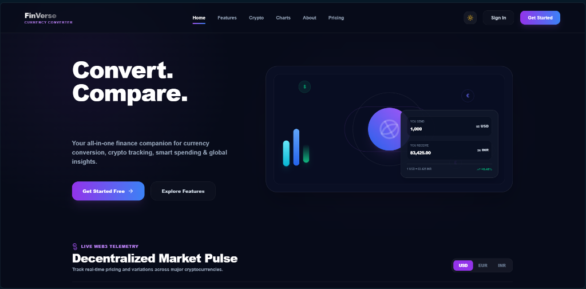

# 🌌 FinVerse — Advanced Currency Converter & AI Finance Platform



## 🚀 Welcome to FinVerse

**FinVerse** is a modern, high-fidelity, and premium Web3-ready financial intelligence platform. Designed to provide institutional-grade tools to individual users, FinVerse bridges the gap between traditional fiat currencies and the decentralized Web3 asset ecosystem. 

Powered by **React.js**, **Framer Motion**, and **Supabase Database & Auth**, FinVerse offers sleek, premium visual experiences coupled with robust real-time calculations.

---

## ✨ Features Breakdown

### 📊 Real-time Dashboard Overview
- Integrated with **live ExchangeRate API feeds** and **Supabase conversions databases** for accurate analytics.
- Real-time user statistics, transaction charts, crypto ratios, and top gainers/losers indices.
- Pure CSS glassmorphic dark-mode & light-mode themes with instant, seamless switching.

### 👥 Admin Panel Dashboard
- **Admin Stats Overview**: Total active users, monthly transaction volumes, live conversion history, and active alerts.
- **User Management**: View, search, edit, and sync real-time converter profiles.
- **Security & Activity Logs**: Track successful transactions, session logs, and system triggers.
- **Live Exchange Rate Monitoring**: View up-to-date buying/selling indicators directly from institutional APIs.

### 🧠 Gemini AI Spending Advisor
- AI-driven currency hedging, cost-reduction, and investment planning suggestions.
- Weekly session volume charts and topic analytics.

### 🔔 Native Rate Alerts
- Standardized local browser alerts module allows users to set, delete, and trigger customized price thresholds.

### 💾 Storage & Privacy Console
- Dynamic real-time sandbox footprint calculation showing exactly what data is stored (`KB`).
- Double-confirmed database cleanup and profile-wiping sequences for absolute data transparency.

---

## 🛠️ Technology Stack

- **Frontend Core**: React.js, Tailwind CSS, JavaScript (ES6+).
- **Animations**: Framer Motion.
- **Charts & Graphs**: Chart.js (`react-chartjs-2`), custom SVG sparklines.
- **Database & Identity**: Supabase (Database, Auth, Row Level Security).
- **AI Engine**: Gemini API Integration.
- **Data Feeds**: Open Exchange Rates / open.er-api.com.

---

## 🚀 Getting Started

### 📋 Prerequisites
Make sure you have [Node.js](https://nodejs.org/) installed on your system.

### ⚙️ Installation

1. **Clone the repository:**
   ```bash
   git clone https://github.com/yourusername/currency_converter_app.git
   cd currency_converter_app
   ```

2. **Install dependencies:**
   ```bash
   npm install
   ```

3. **Launch Local Development Server:**
   ```bash
   npm run dev
   ```
   Open [http://localhost:5173](http://localhost:5173) in your browser to experience the platform!

---

## 🔒 Security & Bank-level Standards

- **256-bit Sandbox Security**: User data, settings, and Gemini API keys are sandboxed directly inside your secure local context.
- **Supabase Authentication**: Integrated with passwordless Magic Links for frictionless, verified sign-ins.
